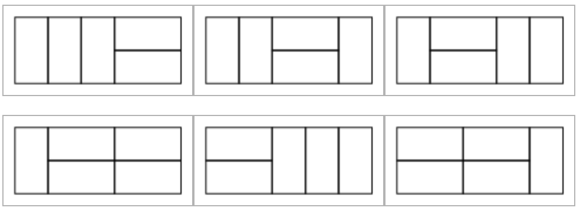
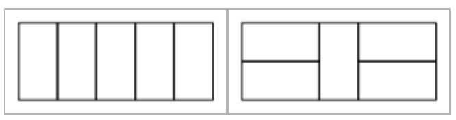

# 4. 비대칭 타일링



그림과 같이 2 * n 크기의 직사각형을 2 * 1 크기의 타일로 채우려고 합니다. 타일들은 서로 겹쳐서는 안 되고, 90도로 회전해서 쓸 수 있습니다. 단 이 타일링 방법은 좌우 대칭이어서는 안 됩니다. 위 그림은 2 * 5 크기의 직사각형을 채우는 비대칭 타일링 방법 6가지를 보여줍니다. 다음의 2가지는 좌우대칭이기 때문에 세지 않습니다.



n 이 주어질 때 가능한 비대칭 타일링 방법의 수를 계산하는 프로그램을 작성하세요. 방법의 수는 매우 클 수 있으므로, 1,000,000,007 로 나눈 나머지를 출력합니다.


#### 입력

입력의 첫 줄에는 테스트 케이스의 수 C (1 <= C <= 50) 가 주어집니다. 그 후 각 줄에 사각형의 너비 n (1 <= n <= 100) 이 주어집니다.


#### 출력

각 테스트 케이스마다 한 줄에 비대칭 타일링 방법의 수를 1,000,000,007 로 나눈 나머지를 출력합니다.


#### 예제 입력

```
3
2
4
92
```


#### 예제 출력

```
0
2
913227494
```