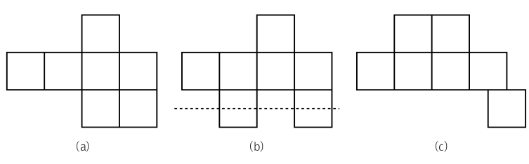

# 6. 폴리오미노

#### 문제

정사각형들의 변들을 서로 완전하게 붙여 만든 도형들을 폴리오미노(Polyomino)라고 부릅니다. n개의 정사각형으로 구성된 폴리오미노들을 만들려고하는데, 이 중 세로로 단조(monotone)인 폴리오미노의 수가 몇 개나 되는지 세고 싶습니다. 세로로 단조라는 말은 어떤 가로줄도 폴리오미노를 두 번 이상 교차하지 않는다는 뜻입니다.



예를 들어 그림 (a)는 정상적인 세로 단조 폴리오미노입니다. 그러나 (b)는 점선이 폴리오미노를 두 번 교차하기 때문에 세로 단조 폴리오미노가 아닙니다. (c)는 맨 오른쪽 아래 있는 정사각형이 다른 정사각형과 변을 완전히 맞대고 있지 않기 때문에 폴리오미노가 아닙니다.

n개의 정사각형으로 구성된 세로 단조 폴리오미노의 개수를 세는 프로그램을 작성하세요.


#### 입력

입력의 첫 줄에는 테스트 케이스의 수 C (1≤C≤50)가 주어집니다. 그 후 각 줄에 폴리오미노를 구성할 정사각형의 수 n (1≤n≤100)이 주어집니다.


#### 출력

각 테스트 케이스마다, n개의 정사각형으로 구성된 세로 단조 폴리오미노의 수를 출력합니다. 폴리오미노의 수가 10,000,000 이상일 경우 10,000,000으로 나눈 나머지를 출력합니다.


#### 예제 입력

```
3
2
4
92
```


#### 예제 출력

```
2
19
4841817
```

